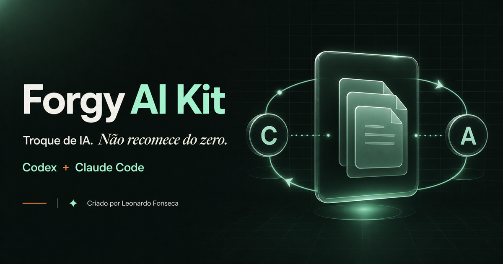

# Forgy AI Kit



Contexto portátil para alternar entre Codex e Claude Code sem recomeçar o projeto do zero.

Criado por Leonardo Fonseca, na Forgy Digital.

[Landing e guia](https://forgy-ai-kit.vercel.app) · [Release mais recente](https://github.com/leulfonseca/forgy-ai-kit/releases/latest)

## O problema que o kit resolve

Codex e Claude Code possuem mecanismos próprios de instruções, chats e memória. Sem uma camada compartilhada, decisões importantes ficam presas em uma ferramenta ou em uma conversa antiga.

O Forgy AI Kit cria uma fonte de verdade versionada dentro de cada projeto:

```text
projeto/
├── AGENTS.md
├── CLAUDE.md
└── docs/ai-context/
    ├── README.md
    ├── ARCHITECTURE.md
    ├── INVARIANTS.md
    ├── CHANGE_PROTOCOL.md
    ├── DECISIONS.md
    ├── CURRENT_WORK.md
    └── MEMORY_MIGRATION.md
```

Assim, você pode trabalhar com Claude Code, fechar a ferramenta e continuar no Codex — ou fazer o caminho inverso — mantendo arquitetura, decisões, invariantes e trabalho ativo acessíveis aos dois agentes.

## Instalação

Requisito: Node.js 18 ou superior.

Instalação guiada (Windows, macOS ou Linux):

```bash
npx --yes https://github.com/leulfonseca/forgy-ai-kit/releases/download/v0.2.0/forgy-ai-kit-0.2.0.tgz install
```

O assistente pergunta onde guardar o kit, quais agentes configurar e pede confirmação antes de alterar arquivos. Para automações, CI ou instalação sem perguntas, informe as opções explicitamente:

```bash
npx --yes https://github.com/leulfonseca/forgy-ai-kit/releases/download/v0.2.0/forgy-ai-kit-0.2.0.tgz install --kit-dir "/caminho/escolhido/forgy-ai-kit" --agents codex,claude --non-interactive
```

O instalador preserva instruções globais existentes, gerencia somente um bloco delimitado e cria backups antes de substituir itens controlados pelo kit.

## Preparar um projeto

```bash
npx --yes https://github.com/leulfonseca/forgy-ai-kit/releases/download/v0.2.0/forgy-ai-kit-0.2.0.tgz init --project-dir "/caminho/do/projeto"
```

Depois, abra o projeto no agente escolhido e peça:

Codex:

```text
Use $forgy-ai-bootstrap para auditar este repositório, preservar o que já existe e completar o contexto compartilhado somente com fatos verificados no código.
```

Claude Code:

```text
Use /forgy-ai-bootstrap para auditar este repositório, preservar o que já existe e completar o contexto compartilhado somente com fatos verificados no código.
```

## Diagnóstico

```bash
npx --yes https://github.com/leulfonseca/forgy-ai-kit/releases/download/v0.2.0/forgy-ai-kit-0.2.0.tgz doctor --agents codex,claude
```

## O que é compartilhado

- arquitetura e limites do sistema;
- invariantes que não podem ser quebrados;
- decisões técnicas e suas razões;
- protocolo de mudança e validação;
- trabalho ativo e próximos passos;
- skills de migração e segurança;
- fatos históricos promovidos após verificação.

## O que não é copiado automaticamente

- chats completos;
- auto memory nativa do Claude Code ou memória local do Codex;
- tokens, credenciais e arquivos `.env`;
- permissões históricas para push, deploy ou produção;
- lembranças não verificadas no código atual.

Memória nativa continua útil para recordação. Regras obrigatórias e conhecimento necessário para não quebrar o projeto pertencem ao repositório versionado.

## Integridade e privacidade

Cada release inclui o pacote `.tgz` e seu checksum SHA-256. Confira o checksum antes de executar o artefato em ambientes sensíveis.

O repositório público contém documentação e releases de distribuição. O ambiente de desenvolvimento, os testes internos e o histórico de construção não são necessários para instalar o kit.

Consulte [SECURITY.md](SECURITY.md) para reportar vulnerabilidades.

## Status

A série `0.2.x` é uma versão inicial. O formato do contexto e os comandos já são versionados, mas a política de licenciamento definitiva será definida antes de uma versão estável.
